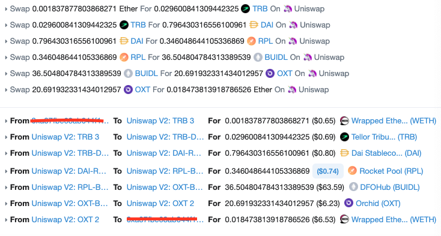

# Uniswap Arbitrage Analysis

## See readme_en.pdf

### 0.Foreword

​	Uniswap is the most popular dex with more than 11000 trading pairs and 2B dollars liquidity. Where there is a market, there are arbitrage opportunities. On uniswap we can trade coin A for coin D follow a given path, e.g. A->B->C->D, A and D can also be the same coin, which means, you can trade A for A follow a given path, and if you are lucky, you can get more A than the original input amount! So how do we find such a path and determine the optimal input amount for maximum profit? Here we go:

### 1.Arbitrage problem alalysis

In order to perform an arbitrage, we need to figure out 2 things:

* How to find the best path: from A->?->?->...->A
* How to find the optimal input amount?

#### 1.1 Path finding

Each coin is a vertex of a graph, and each trading pair is an edge in the graph, now the problem is how to find a circle in such a graph? This is a classic graph problem, we can use depth first search(DFS) to solve it, with DFS, we can also control the max path length, which is import for an arbitrage since longer path requires more gas! Here is a sample code:

```python
def findArb(pairs, tokenIn, tokenOut, maxHops, currentPairs, path, circles):
    for i in range(len(pairs)):
        newPath = path.copy()
        pair = pairs[i]
        if not pair['token0']['address'] == tokenIn['address'] and not pair['token1']['address'] == tokenIn['address']:
            continue
        if pair['reserve0']/pow(10, pair['token0']['decimal']) < 1 or pair['reserve1']/pow(10, pair['token1']['decimal']) < 1:
            continue
        if tokenIn['address'] == pair['token0']['address']:
            tempOut = pair['token1']
        else:
            tempOut = pair['token0']
        newPath.append(tempOut)
        if tempOut['address'] == tokenOut['address'] and len(path) > 2:
          	c = { 'route': currentPairs, 'path': newPath }
            circles.append(c)
        elif maxHops > 1 and len(pairs) > 1:
            pairsExcludingThisPair = pairs[:i] + pairs[i+1:]
            circles = findArb(pairsExcludingThisPair, tempOut, tokenOut, maxHops-1, currentPairs + [pair], newPath, circles)
    return circles
```

#### 1.2 Optimal input amount

Let's do a little recap on the uniswap constant function market maker(CFMM) model, assume there is  a trading pair for coin A and B, reserve for A is $R_0$, reserve for B is $R_1$, now we use ${\Delta}_a$ amount of A to trade for $\Delta_b$ amount of B, assume the fee is $1-r$, the following equation holds:

$(R_0 + r\Delta_a)(R_1 - \Delta_b) = R_0R_1$

The equation means that the product of the reserves $R_0R_1$ remains constant during the trade, this is why we call it constant function market maker.

Now assume we have found a circle path: A->B->C->A, how do we find the optimal input amount? This is an optimization problem:

$$
\begin{align}
& max  ({\Delta_a}' - \Delta_a) \\\\
& s.t. \\
& R_n > 0, \Delta_n > 0 \\\\
& (R_0 + r\Delta_a)(R_1 - \Delta_b) = R_0R_1 \tag1 \\\\
& ({R_1}' + r\Delta_b)(R_2 - \Delta_c) = {R_1}'R_2 \tag2 \\\\
& ({R_2}' + r\Delta_c)(R_3 - {\Delta_a}') = {R_2}'{R_1}' \tag3
\end{align}
$$

Equation (1) holds during the trade from A to B, (2) holds during the trade from B to C, and (3) holds during the trade from C to A. It seems pretty simple since we only have 3 equations now, we can get the representation for ${\Delta_a}'$ in ${\Delta_a}$, then calculate the derivative of ${\Delta_a}' - \Delta_a$ to find out what the optimal ${\Delta_a}$ is.

What if the path is longer? A->B->C->...->A. We need a general solution for arbitrary length path.

Consider the A->B->C situation, maybe there is not a trading pair directly from A to C, but with B as the bridge, we can trade A for C, we say there is a **virtual** trading pool for A and C, can we get the reserves parameter $E_0, E_1$ for this virtual pool?

All we need to do is find the representation for $E_0, E_1$ in $R_0, R_1, {R_1}', R_2$, i.e. the pool parameters of A->B and B->C.

According to equation(1)(2), we have:

$$
\Delta_b = \frac{R_1r\Delta_a}{R_0+r\Delta_a} \tag4
$$

$$
\Delta_c = \frac{R_2r\Delta_b}{{R_1}'+r\Delta_b} \tag5
$$

Replace $\Delta_b$ in (5) using (4), we have:

$$
\Delta_c = \frac{\frac{rR_1R_2}{{R_1}'+R_1r}r\Delta_a}{\frac{R_0{R_1}'}{{R_1}'+R_1r}+r\Delta_a} \tag6
$$

Comparing the form of (6) and (4) or (6) and (5), we have:

$$
E_0 = \frac{R_0{R_1}'}{{R_1}'+R_1r}
$$

$$
E_1 = \frac{rR_1R_2}{{R_1}'+R_1r}
$$

Now we have the parameters for virtual pool A->C, consider the path A->B->C->A, with the virtual pool, the path is now: A->C->A, we can further calculate the parameters for A->A, say $E_a, E_b$, if  $E_a < E_b$, then there is an arbitrage opportunity. For arbitrary length path, we can calculate $E_a, E_b$ iteratively.

Now we have the parameters $E_a, E_b$ for this virtual pool from A->A constructed from the given path, we have:

$$
\begin{align}
& {\Delta_a}' = \frac{E_ar\Delta_a}{E_0+r\Delta_a} \\
& f = {\Delta_a}' - \Delta_a
\end{align}
$$

Here $f$ is our profit, calculate its derivative, we can find the optimal input amount:

$$
\Delta_a = \frac{\sqrt{E_aE_br}-E_a}{r}
$$

Code for path finding with optimal input amount calculation:

```python
def findArb(pairs, tokenIn, tokenOut, maxHops, currentPairs, path, bestTrades, count=5):
    for i in range(len(pairs)):
        newPath = path.copy()
        pair = pairs[i]
        if not pair['token0']['address'] == tokenIn['address'] and not pair['token1']['address'] == tokenIn['address']:
            continue
        if pair['reserve0']/pow(10, pair['token0']['decimal']) < 1 or pair['reserve1']/pow(10, pair['token1']['decimal']) < 1:
            continue
        if tokenIn['address'] == pair['token0']['address']:
            tempOut = pair['token1']
        else:
            tempOut = pair['token0']
        newPath.append(tempOut)
        if tempOut['address'] == tokenOut['address'] and len(path) > 2:
            Ea, Eb = getEaEb(tokenOut, currentPairs + [pair])
            newTrade = { 'route': currentPairs + [pair], 'path': newPath, 'Ea': Ea, 'Eb': Eb }
            if Ea and Eb and Ea < Eb:
                newTrade['optimalAmount'] = getOptimalAmount(Ea, Eb)
                if newTrade['optimalAmount'] > 0:
                    newTrade['outputAmount'] = getAmountOut(newTrade['optimalAmount'], Ea, Eb)
                    newTrade['profit'] = newTrade['outputAmount']-newTrade['optimalAmount']
                    newTrade['p'] = int(newTrade['profit'])/pow(10, tokenOut['decimal'])
                else:
                    continue
                bestTrades = sortTrades(bestTrades, newTrade)
                bestTrades.reverse()
                bestTrades = bestTrades[:count]
        elif maxHops > 1 and len(pairs) > 1:
            pairsExcludingThisPair = pairs[:i] + pairs[i+1:]
            bestTrades = findArb(pairsExcludingThisPair, tempOut, tokenOut, maxHops-1, currentPairs + [pair], newPath, bestTrades, count)
    return bestTrades
```

### 2. Implementation

Ethereum block interval is 15 seconds, you have to do 3 things in 15 seconds:

* Update the reserves of each trading pair:
  * Small amount of trading pairs: batch request for the states of all trading pairs
  * Large amount of trading pairs: batch request, then parse every new block, if there is a event in (Swap, Sync, Mint, Burn), update the related pair reserves.
* Find the best path and optimal input amount:
  * Optimize DFS, explore other algorithms like bellman-ford, spfa, etc.
* Send the transaction:
  * Call UniswapV2Router02.getAmountsOut before you send your tx, confirm that you can really make a profit.

My test:



Didn't cover the gas fee though :(

### 3.Finally

Uniswap arbitrage is a competitive area, you may find it hard to make profit, but still, Defi is the haven for arbitraguers, you can also arbitrage between different exchanges like curve.fi, balancer.exchange, with flashloans, you can even borrow money to make arbitrage! Happy hacking :)

Contact: ccyanxyz@gmail.com

Donation: 0x0af66d3641640755878F0d72A610FC2EEA856Cd6


